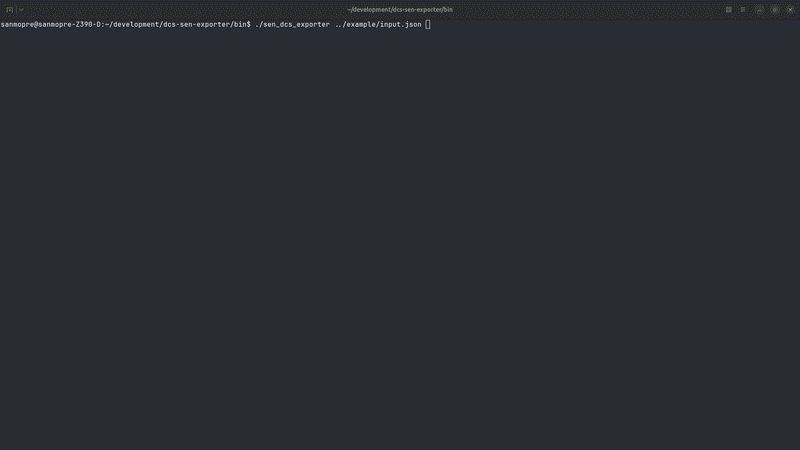

# DCS sen exporter ✈️

A CLI tool that converts a Digital Combat Simulator (DCS) mission recording into a sen recording.

## Installation ⚙️

### DCS

Copy [`Export.lua`](DCS/Export.lua) into your Windows user `Saved Games/DCS/Scripts` directory.

### dcs-sen-exporter 

Download the latest release, or build the project from source.
To build from source, install Conan and run:

```bash
conan install . --build=missing
conan build .
```

## Conversion Pipeline 🔗


### 1. Generate a DCS recording

After placing the export script in the correct folder, simply start a mission. The script will automatically record every entity in the mission to an NDJSON file on every frame.

Once the mission ends, the recording will be available in the DCS `Logs` directory.


### 2. Convert the recording

To convert the recording into a sen recording, configure the path to the generated NDJSON file in `input.json` and pass it to the `dcs-sen-exporter` executable.

Once everything is configured, run the executable to start the conversion.



### 3. Replay the sen recording

After the sen recording has been generated, you can replay it and inspect the entities using your sen applications.

